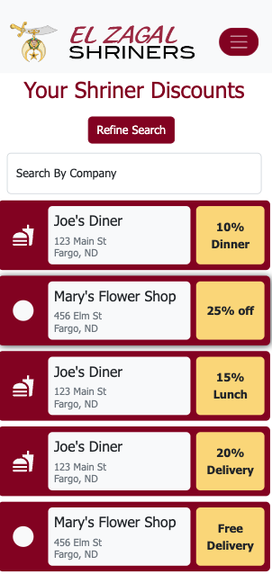
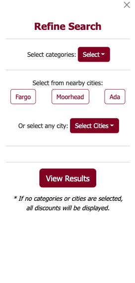
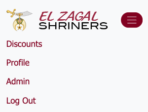
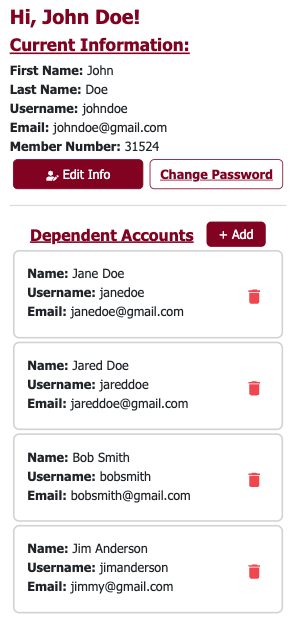
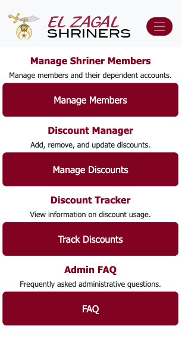
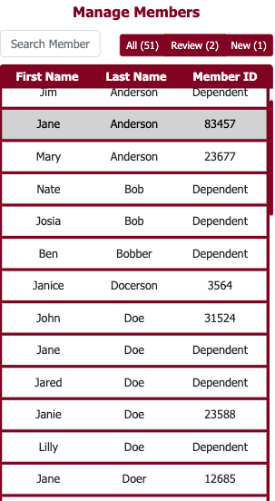
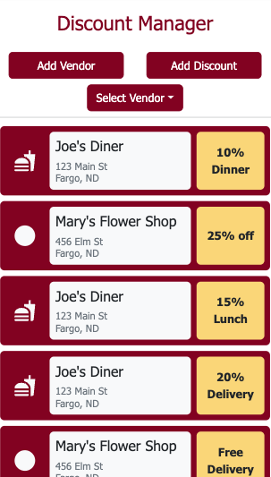
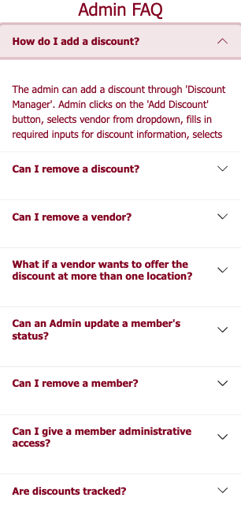
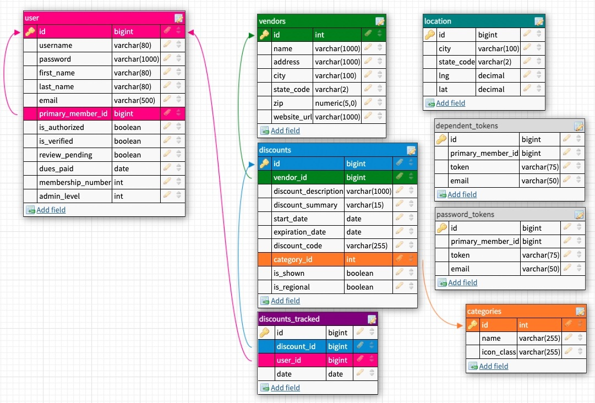

# El Zagal Shriner Member Portal

The Member Portal has state-of-the-art authorization and authentication to keep member information safe while giving them access to local benefits offered to them.  The Member Portal will primarily be used for traveling Shriners to be able to quickly access local savings in whatever area they are currently in or planning to travel to.

With a robust administrative section, head Shriners will have the ability to add and remove discounts, vendors, and users. The Member Portal also gives them the capability of activating and deactivating discounts and users without fully deleting them.

## Preview

## Prerequisites

This version uses React, Redux, Express, Passport, and PostgreSQL (a full list of dependencies can be found in `package.json`).

We **STRONGLY** recommend following these instructions carefully.

Before you get started, make sure you have the following software installed on your computer:

- [Node.js](https://nodejs.org/en/)
- [npm](https://docs.npmjs.com/)
- [PostrgeSQL](https://www.postgresql.org/)
- [Nodemon](https://nodemon.io/)

## Create database and tables

Create a new database called `el_zagal_shriners`.

All tables and SQL queries can be found in the `databaseSetup.sql` file.

If you would like to name your database something else, you will need to change `el_zagal_shriners` to the name of your new database name in `server/modules/pool.js`

## Development Setup Instructions

- Run `npm install`
- Start postgres if not running already by using `brew services start postgresql`
- Run `npm run server`
- Run `npm run client`
- Navigate to `localhost:3000`

## Production Build

Before pushing to Heroku, run `npm run build` in terminal. This will create a build folder that contains the code Heroku will be pointed at. You can test this build by typing `npm start`. Keep in mind that `npm start` will let you preview the production build but will **not** auto update.

- Start postgres if not running already by using `brew services start postgresql`
- Run `npm start`
- Navigate to `localhost:5000`

## Deployment

#### Using Heroku

###### Steps

1. 
